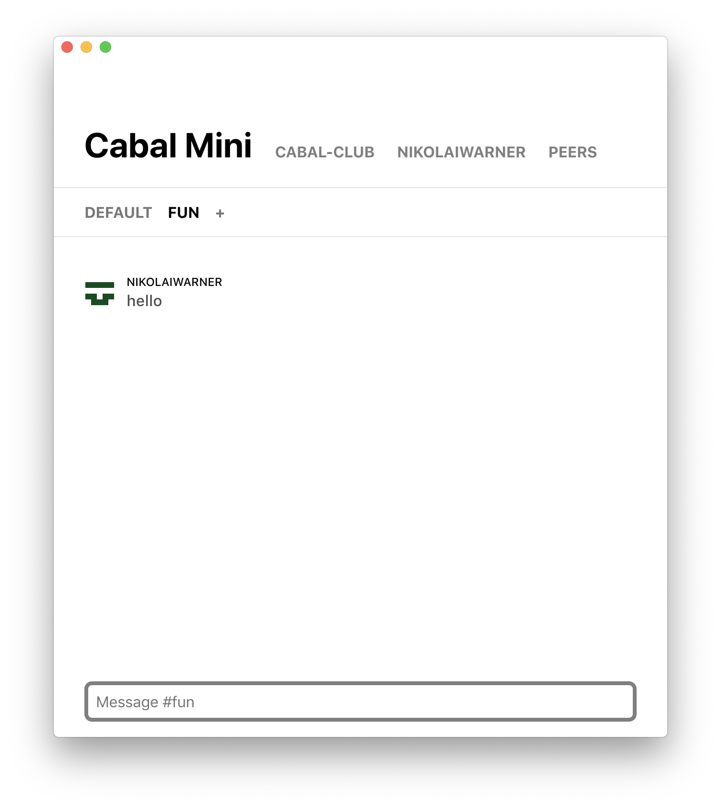

# Cabal Desktop Mini

> A minimal desktop app for Cabal, the p2p/decentralized/offline-first chat platform.

<3 nikolaiwarner

<center></center>

## Install

### Download the latest release

https://github.com/nikolaiwarner/cabal-desktop-mini/releases/

### Build from source

```
$ git clone https://github.com/nikolaiwarner/cabal-desktop-mini
$ cd cabal-desktop-mini

$ npm install             # install dependencies
$ npm start               # start the application
```

## Distribute

build for current platform:

```
$ npm run build
```

build for [multiple platforms](https://www.electron.build/multi-platform-build#docker):

```
$ npm run dist
```
